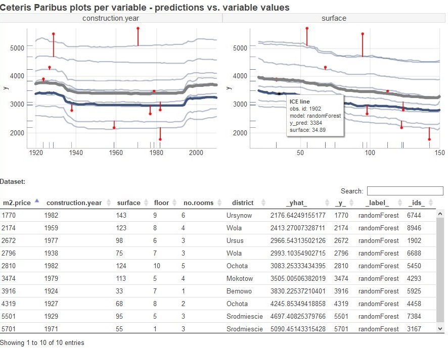
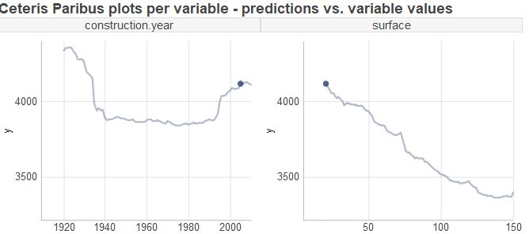
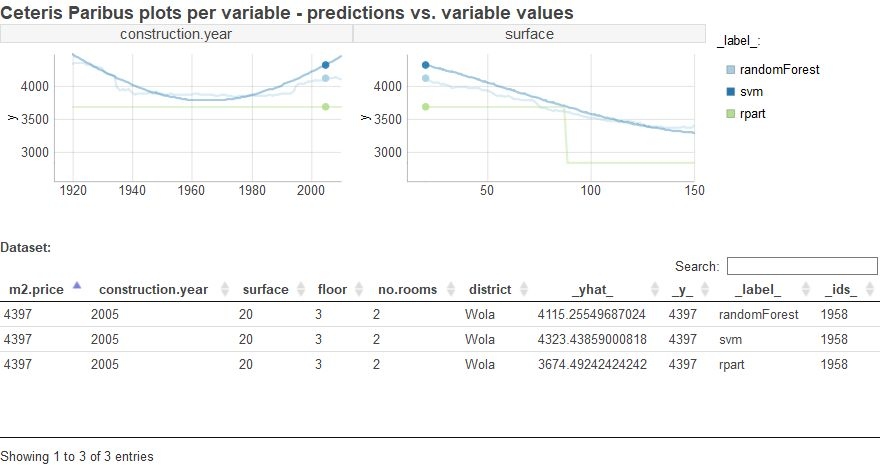

# ceterisParibusD3

[ceterisParibus]( https://github.com/pbiecek/ceterisParibus) package extension (interactive plots in D3), built as htmlwidget. ceterisParibusD3 plots adds:

- **tooltips** (shows info about given element (line, point) after hovering over it, hovering over an element causes also highlighting it on given panel (increasing its stroke, opacity or size) and highlighting elements related to the same data point in other panels)

- **interactive table** (user can hover over each row, which causes highlighting elements related to this observation and hiding unrelated elements (apart from rugs and pdps), also filtering and sorting rows is available)

<center></center>


## Installation

To install package use R command:

```
devtools::install_github(repo = 'flaminka/ceterisParibus' )
```

## Examples

ICE curves for single observation:

<center></center>

ICE curves for single observation - model comparison:

<center></center>

## More examples

To see more examples and comparison to plots from [ceterisParibus]( https://github.com/pbiecek/ceterisParibus) package check [this file](inst/htmlwidgets/examples/more_examples.html).


## Documentation

To see help use R command:

```
?ceterisParibusD3::ceterisParibusD3
```

or see [manual](manual.pdf)


## Issues and suggestions

To report a bug or propose new feature please review these guidelines:

* make sure you have the latest version of the package
* check whether it is not already in [Issues](https://github.com/flaminka/ceterisParibusD3/issues)
* add an issue following suitable template: for [bugs](https://github.com/flaminka/ceterisParibusD3/blob/master/bug_template.md) or for [suggestions](https://github.com/flaminka/ceterisParibusD3/blob/master/suggestion_template.md)

       

